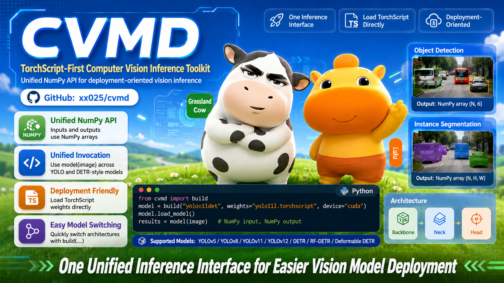

# CVMD



[中文文档](doc/README_zh.md)

> A TorchScript-first computer vision inference toolkit with a unified NumPy API.

## Why CVMD

- **One inference interface**: use the same `model(image)` pattern across YOLO and DETR-style models.
- **Deployment-oriented**: load TorchScript weights directly without carrying training repositories into production.
- **Easy model switching**: swap architectures with `build(...)` while keeping the same input/output convention.
- **Practical scaling path**: start with simple single-image inference, then expand to sliding-window or Ray-based distributed runs when needed.

## Installation

```bash
pip install cvmd
```

## Quick Start

```python
import imageio.v3 as iio
from cvmd import build

model = build("yolov11det", weights="yolo11l.torchscript", device="cuda")
model.load_model()

image = iio.imread("image.jpg")
results = model(image)
# results: [x1, y1, x2, y2, confidence, class]
```

## Supported Models

| Model Series | Task | Registered Names |
| :--- | :--- | :--- |
| **YOLOv12** | Detection / Segmentation | `yolov12det`, `yolov12seg` |
| **YOLOv11** | Detection / Segmentation | `yolov11det`, `yolov11seg` |
| **YOLOv8** | Detection / Segmentation | `yolov8det`, `yolov8seg` |
| **YOLOv5** | Detection / Segmentation | `yolov5det`, `yolov5seg` |
| **DETR** | Detection | `detr` |
| **RF-DETR** | Detection | `rfdetr`, `rfdetrdetect`, `rf-detr` |
| **Deformable DETR** | Detection | `deformabledetr`, `deformable_detr`, `deformable-detr` |

## Core API

- `build(model_name_or_cls, **kwargs)`: build a model instance by name or class.
- `list_models()`: list registered model names.
- `register_model(*names)`: register a custom model class.

Detection models return:

```python
# np.ndarray, shape=(N, 6)
# [x1, y1, x2, y2, confidence, class]
```

Segmentation models return:

```python
# (detections, masks)
# detections: np.ndarray, shape=(N, 6)
# masks: np.ndarray, shape=(N, H, W)
```

## More Docs

- [Chinese README](doc/README_zh.md)
- [Guide](doc/guide.md)
- [Examples and tests](test/)

## Development

```bash
git clone <this repository>
cd cvmd
uv sync --dev
```
