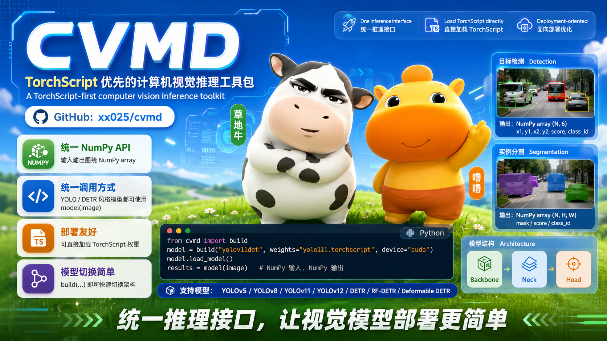

# CVMD



[English](../README.md)

> 一个面向部署的统一视觉模型推理接口。

## 为什么使用 CVMD

用一套统一的推理接口覆盖多种视觉模型，同时避免在部署环境中携带训练代码仓库。

- **一套 API 适配多种模型**：YOLO 和 DETR 风格模型都可以使用同一个 `model(image)` 工作流。
- **以 TorchScript 部署为优先**：直接加载可部署权重，让推理环境更轻、更干净。
- **上手简单，扩展自然**：可以先做单图推理，后续再平滑扩展到滑窗推理或基于 Ray 的分布式流程。

## 安装

```bash
pip install cvmd
```

## 快速开始

```python
import imageio.v3 as iio
from cvmd import build

model = build("yolov11det", weights="yolo11l.torchscript", device="cuda")
model.load_model()

image = iio.imread("image.jpg")
results = model(image)
# results: [x1, y1, x2, y2, confidence, class]
```

## 当前支持的模型

| 模型系列 | 任务 | 注册名称 |
| :--- | :--- | :--- |
| **YOLOv12** | 检测 / 分割 | `yolov12det`, `yolov12seg` |
| **YOLOv11** | 检测 / 分割 | `yolov11det`, `yolov11seg` |
| **YOLOv8** | 检测 / 分割 | `yolov8det`, `yolov8seg` |
| **YOLOv5** | 检测 / 分割 | `yolov5det`, `yolov5seg` |
| **DETR** | 检测 | `detrdet` |
| **RF-DETR** | 检测 | `rfdetrdet` |
| **Deformable DETR** | 检测 | `deformabledetrdet` |

## 核心 API

- `build(model_name_or_cls, **kwargs)`：按名称或类创建模型实例。
- `list_models()`：列出当前已注册模型。
- `register_model(*names)`：注册自定义模型类。

检测模型返回：

```python
# np.ndarray, shape=(N, 6)
# [x1, y1, x2, y2, confidence, class]
```

分割模型返回：

```python
# (detections, masks)
# detections: np.ndarray, shape=(N, 6)
# masks: np.ndarray, shape=(N, H, W)
```

## 更多文档

- [English README](../README.md)
- [使用指南](guide_zh.md)
- [示例与测试](../test/)

## 开发

```bash
git clone <this repository>
cd cvmd
uv sync --dev
```
